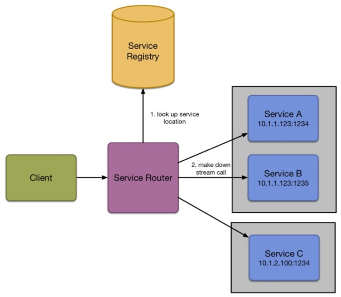
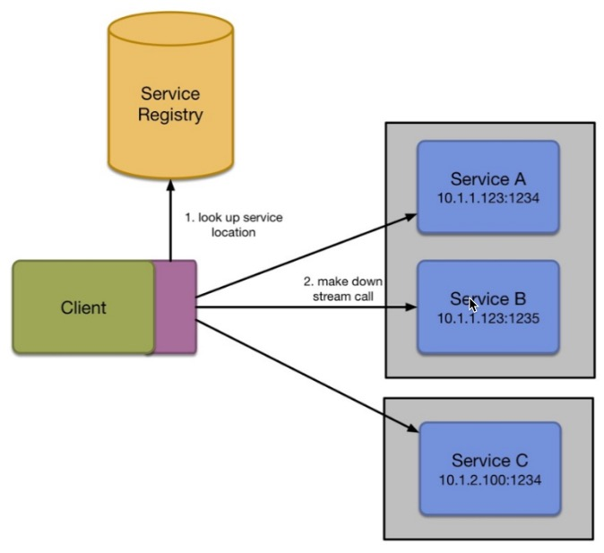

# Event Processing Pattern

## Design for failure
In his book Designing Data-Intensive Applications, Martin Kleppman makes the following comment **failure driven design patterns**:
>The bigger a system gets, the more likely it is that one of its components is broken. Over time, broken things get fixed, and new things break, but in a system with thousands of nodes, it is reasonable to assume that something is always broken. If the error handling strategy consists of only giving up such a large system would never work.

I like this quotation: 
>software is complex, and with complexity, it is easy to make mistakes.

## Event Processing Pattern
Event processing is a model which allows you to decouple your microservices by using a message queue. Rather than connect directly to a service which may or may not be at a known location, you broadcast and listen to events which exist on a queue, such as Redis, Amazon SQS, NATS.io, Rabbit, Kafka, and a whole host of other sources.

Example message for Email third-party message queue:
```json

{
    "id": "ABCDERE2342323SDSD",
    "queue" "registration.welcome_email",
    "dispatch_date": "2016-03-04 T12:23:12:232",
        "payload": {
        "name": "Nic Jackson",
        "email": "mail@nicholasjackson.io"
        }
}
```

### Handling Errors
We can add the message back onto the queue augmenting it with the error message which occurred at the time as seen in the following example:
```json
{
    "id": "ABCDERE2342323SDSD",
    "queue" "registration.welcome_email",
    "dispatch_date": "2016-03-04 T12:23:12:232",
        "payload": {
        "name": "Nic Jackson",
        "email": "mail@nicholasjackson.io"
        },
    "error": [{
    "status_code": 3343234,
    "message": "Message rejected from mail API, quota exceeded",
    "stack_trace": "mail_handler.go line 32 ...",
    "date": "2016-03-04 T12:24:01:132"
    }]
}
```

It is important to append the error every time we fail to process a message as it gives us the history of what went wrong, it also provides us with the capability to understand how many times we have tried to process the message because after we exceed this threshold we do not want to continue to retry we need to move this message to a second queue where we can use it for diagnostic information.

### Dead Letter Queue
This second queue is commonly called a dead letter queue, a dead letter queue is specific to the queue from where the message originated, if we had a queue named order_service_emails then we would create a second queue called order_service_emails_deadletter. The purpose of this is so that we can examine the failed messages on this queue to assist us with debugging the system, there is no point in knowing an error has occurred if we do not know what that error is and because we have been appending the error details direct to the message body we have this history right where we need it.

### Idempotent transactions and message order
In Event-Driven Architecture, an idempotent transaction is a transaction that can be repeated multiple times without producing a different result. This is often achieved by assigning a unique identifier to each transaction and ensuring that the same identifier is used if the transaction is repeated.
In the context of messaging, message order refers to the order in which messages are processed by the system. In many cases, it is important to maintain the order in which messages are received in order to ensure that processing occurs correctly. However, message order can be a challenge in distributed systems where messages may be processed asynchronously across multiple nodes.

### Atomic transactions
In Event-Driven software engineering, Atomic transactions refer to transactions in which multiple operations are performed atomically and reversibly in response to an event. In other words, an atomic transaction consists of a series of operations that have no value on their own and only have significant value when all operations have been completed.

Atomic transactions are very useful in Event-Driven architecture because they easily synchronize information between microservices and prevent errors due to dual operations. Additionally, in case of any error, Atomic transactions are capable of returning the system to its previous state.

### Package go for resiliency patterns
```
go get github.com/eapache/go-resiliency
```
### 1- Timeout Pattern
A timeout is an incredibly useful pattern while communicating with other services or data stores. The idea is that you set a limit on the response of a server and, if you do not receive a response in the given time, then you write a business logic to deal with this failure, such as retrying or sending a failure message back to the upstream service.
* Connection Timeout - The time it takes to open a network connection to the server
* Request Timeout - The time it takes for a server to process a request

The Timeout pattern is a common pattern used in event-driven systems to handle situations where a response to an event or request has not been received within a specified timeframe.<br/>
In this pattern, a timer is set when an event or request is made, and if the expected response is not received before the timer expires, a timeout event is triggered. The system can then take appropriate action based on the timeout event, such as retrying the request or notifying the user that the operation has failed.<br/>
In the context of microservices, the Timeout pattern is a strategy used for handling situations where a microservice does not respond within an expected timeframe.<br/>
When one microservice sends a request to another microservice, it may need to wait for a response before proceeding with its work. However, if the response takes too long, this could cause a delay or even a failure in the overall process.<br/>
To avoid such issues, the Timeout pattern can be used. When a microservice sends a request to another microservice, it sets a maximum time for the response to be received. If the response is not received within that time, the requesting microservice can assume that the other microservice is unavailable or has failed and take appropriate action, such as sending an error message to the user or retrying the request.<br/>
Timeouts are critical in microservices architecture because they help to prevent cascading failures and ensure that the system remains stable even when some of the microservices become unresponsive.<br/>

To create timeout for any service, we follow [link](./01-Timeouts/readme.md)
### Context package
Package context defines the Context type, which carries deadlines, cancellation signals, and other request-scoped values across API boundaries and between processes.<br/>
More details: [here](https://pkg.go.dev/context)

### Note: Implement timeout using Context is good solution and best way .

### 2- Back off
The Backoff pattern is a technique used to handle network failures and reduce the impact of those failures on the system. It involves waiting for a certain amount of time before retrying an operation that has failed due to a network failure or other issues.<br/>
The basic idea behind the Backoff pattern is to gradually increase the wait time between retries, with the aim of reducing the number of requests sent to a failing service while still allowing time for the service to recover. This helps to prevent overwhelming the service with too many requests and causing further problems.<br/>
There are several variations of the Backoff pattern, including fixed, linear, exponential, and random backoff. Each variation has its own advantages and disadvantages, depending on the specific use case and requirements of the system.<br/>
Overall, the Backoff pattern is a useful tool for building resilient and fault-tolerant microservices that can handle network failures gracefully.<br/>
To create backoff for any service, we follow [link](./02-BackOff/readme.md)

### 3- Circuite Breaking
We have looked at some patterns like timeouts and back-offs, which help protect our systems from cascading failure in the instance of an outage. However, now it's time to introduce another pattern which is complementary to this duo. Circuit breaking is all about failing fast.<br/>
The Circuit Breaker pattern is a design pattern used in microservices architecture to prevent cascading failures and improve the resilience of distributed systems. It is essentially a safety mechanism that monitors service calls and prevents them from causing failures in the system when there is network congestion or service disruptions.<br/>
The Circuit Breaker pattern works by wrapping calls to remote services with a circuit breaker object, which tracks the number of failures and opens the circuit if the failure rate exceeds a certain threshold. Once the circuit is open, subsequent calls to the service are blocked for a specified period, allowing the service to recover before being called again. If the service recovers and begins responding normally, the circuit is closed again, and requests can be made to it.<br/>
By using the Circuit Breaker pattern, microservices can degrade gracefully when under stress, preventing catastrophic system failures and improving overall system availability and reliability.<br/>
More details:[link](./03-CiruitBreaking/readme.md)

### 4- Health checks
Health check is a pattern widely used in microservices architectures to ensure that all services are available and functioning correctly. The basic idea of health checks is to periodically check the status of each service by sending a request to its endpoint and verifying the response. If the response indicates that the service is healthy, it means that the service is ready to receive requests and handle them properly.<br/>
In a microservices architecture, where multiple services work together to provide a business function, it is essential to ensure that each service is available and responsive. Health checks help in achieving this goal by monitoring the services and providing alerts if any service is down or not responding correctly. This enables quick recovery and helps prevent cascading failures in the system.<br/>
Health checks can be implemented in different ways depending on the technology stack and infrastructure used. Some common methods include HTTP endpoints, TCP probes, and database queries. Tools like Kubernetes provide built-in support for health checks that can be easily configured and monitored.<br/>
More details:[link](./04-HealthCheck/readme.md)

### 5-Throttling (Rate Limiting)
Throttling is a pattern in microservices architecture that refers to the practice of limiting the number of requests made to a service within a certain period. This is done to prevent overloaded services, which can lead to reduced performance, increased latency, and even failures.<br/>
Throttling can be implemented at various levels:<br/>
1. Application level: In this approach, the application itself implements throttling logic to limit the number of incoming requests. For example, the application may allow a certain number of requests per second or minute from each client.
2. API Gateway level: An API gateway can be used to control the traffic between clients and services. The gateway can enforce rate limits and quotas on incoming requests, monitor traffic, and provide analytics.
3. Service level: Throttling can also be implemented at the individual service level, where the service sets its own limits for incoming requests.
Throttling can help prevent service degradation, improve reliability, and ensure fair usage of resources among clients. However, it's important to strike the right balance between throttling and allowing sufficient traffic to meet business requirements.<br/>
More details:[link](./05-Throttling/readme.md)

### 5- Service discovery
n a microservices architecture, service discovery refers to the mechanism by which services can discover and communicate with other services within the same system.<br/>
Service discovery allows services to discover information about other services, such as their location, IP address, and available endpoints. This information is typically stored in a registry or directory, which acts as a central point of reference for all the services in the system.<br>
When a service wants to communicate with another service, it can use the information from the registry to locate the service and its endpoints. This allows services to be decoupled from each other, as they do not need to know the specific location or implementation details of other services in the system.<br/>
Service discovery is an important aspect of microservices architecture as it enables the system to be more flexible and scalable. Without service discovery, services would need to have knowledge of each other's location and implementation details, which can create tight coupling and make it difficult to modify or scale the system.<br/>

### 5-1- Server-side service discovery
Server-side service discovery is a type of service discovery in microservices architecture where the responsibility of discovering and locating services is handled by the server or the infrastructure layer.<br/>
In this approach, each service registers itself with a central registry or directory when it starts up. The registry contains information such as the service's name, IP address, port number, and other metadata that describe the service. When a client needs to communicate with a particular service, it queries the registry for the location of the desired service.<br/>
The advantages of server-side service discovery include simplicity and ease of use. Since the server is responsible for maintaining the registry, clients do not need to know how to locate services themselves. This means that clients can be simpler and more lightweight, which can be especially important in resource-constrained environments.<br/>
However, one potential disadvantage of server-side service discovery is that it can create a single point of failure. If the registry goes down, all services that rely on it may be unable to communicate with each other. To mitigate this risk, many implementations of server-side service discovery incorporate mechanisms for redundancy and failover.<br/>
* The problem with this approach is that the reverse proxy starts to become a bottleneck.this pattern introduces latency.
* Then what about consistency: you are potentially going to have two different failure patterns in your code for downstream calls, one for internal services and one for external. This is only going to add to the confusion.
* The biggest problem for me, however, is that you have to centralize this failure logic.
* To my mind, the worst implementation of this pattern is the one that abstracts all this knowledge from the client, retrying internally, and never letting the calling client know what is happening until success or catastrophic failure.

* 

### 5-2- Client-side service discovery
Client-side service discovery is a technique used in microservices architecture to locate and communicate with other services within the system. In this approach, the responsibility of discovering available services is handled by the clients themselves rather than relying on a centralized registry or load balancer.<br/>
When a client needs to make a request to a particular service, it queries a service registry or discovery server to obtain the location of the service instances. The registry responds with a list of available instances, and the client selects one to use for the current request. This allows the client to make intelligent decisions about which instances to use based on factors such as availability, latency, and geographic proximity.<br/>
In contrast to server-side discovery, where a central component manages the routing of requests to available service instances, client-side discovery offers greater flexibility and scalability. Each client can implement its own customized load-balancing and failover strategies, reducing the burden on the central component and improving overall system performance and reliability.<br/>
* This gives you greater control over what happens when a failure occurs.You can implement the business logic on a retry of a failure on a case-by-case basis, and this will also protect you against cascading failure.
* the client is responsible for the service discovery and load balancing.
* You still hook into a dynamic service registry to get the information for the services you are going to call. This logic is localized in each client, so it is possible to handle the failure logic on a case-by-case basis.

* 