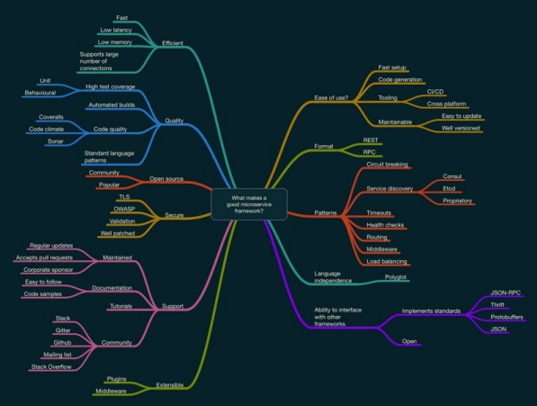
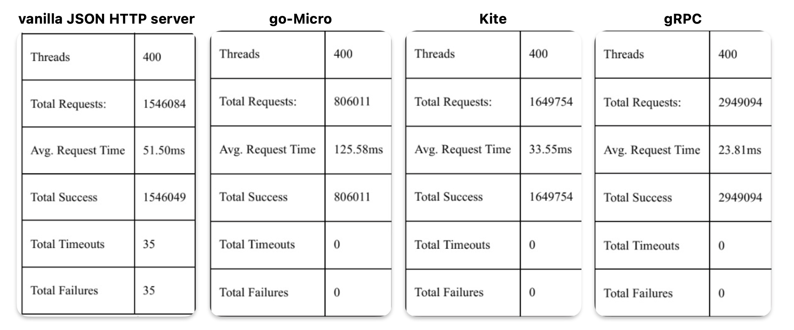
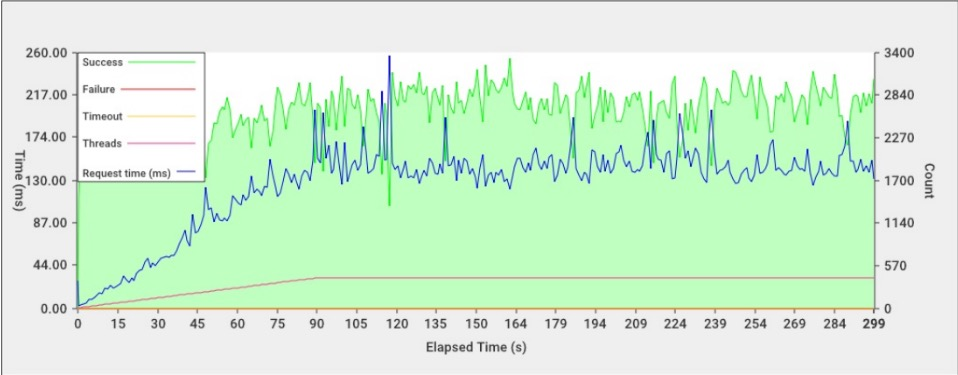
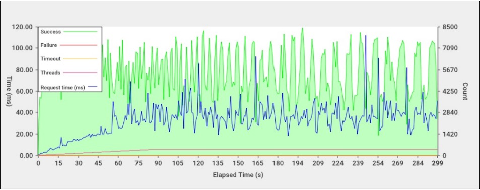
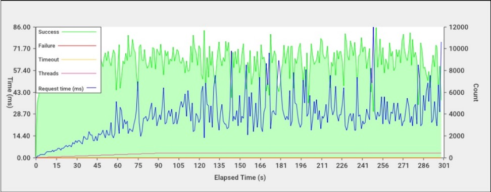

# golang Microservice Frameworks

* **Ability to interface with other frameworks:** It must be possible to interact with any service built with the framework by clients who are not built using the same framework.
  * **Implement standards:** A standard message protocol should be used to maximize interaction, for example:
    * JSON-RPC
    * Thrift
    * Protocol Buffers
    * JSON
  * **Open:** The framework should be open in both the source code and the roadmap.

* **Patterns:** The framework must implement the standard patterns of microservice architecture:
  * **Circuit breaking:** Client calls to downstream services must implement circuit breaking.
  * **Service discovery:** It must be capable of registering with a dynamic service registry and capable of querying the same registry to locate connected services
  * **Proprietary:** Proprietary service registries must be open and usable from other clients who do not implement the framework or its SDKs.
  * **Timeouts:** Downstream client calls should be configurable with a user determined timeout.
  * **Health checks:** The framework must create an automatic health check endpoint.
  * **Routing:** The framework must support multiple routes with an easy to use pattern based matching. Middleware: The framework must support middleware to allow the user to create shared code for handlers.
  * **Load balancing:** Downstream client connections should be capable of load balancing.
  * **Language independence:** The framework needs to be language independent to enable cross-team polyglot workflow.At a minimum, it should be possible to create client SDKs in multiple languages.

* **Communication Protocols:** The service should support good standards in one of the following communication protocols:
  * **REST:** If the framework implements REST, it must take full advantage of semantic API design with appropriate use of HTTP verbs and status codes.
  * **RPC:** If the framework is RPC-based, it must use a standard and open messaging protocol. 

* **Maintainable:** The framework must be maintainable with the minimum effort:
  * **Easy to update:** It must be easy to update with the minimum amount of code changes. 
  * **Well versioned:** The framework must be well versioned with breaking changes to the API mainly restricted to major version updates.

* **Tooling:** There must be adequate tooling to fit with modern development practices:
  * **CI/CD:** It must integrate and work well with continuous integration and continuous deployment pipelines; the tooling must be scriptable.
  * **Cross-platform:** The tools must work cross-platform, with OSX, and Linux as a bare minimum.
  
* **Code generation:** It should support code generation templates to scaffold a service and possibly extend the service.
* **Fast set up:** The framework should be fast to set up and with the minimum number of steps and dependencies.
* **Ease of use:** Any good framework should be easy to use; you will not thank yourself for choosing a framework which is a pain to work with. This category has been broken down into the following subcategories:
* **Extensible:** When required, the user should be able to extend the framework through: 
  * **Plugins:** A pluggable software architecture to be able to create generators and templates. 
  * **Middleware:** Extension through handler middleware.

* **Support:** A good support network is incredibly important throughout the life cycle of the service. 
  * **Maintained:** The framework must be well maintained with:
    * **Regular updates:** The framework is regularly updated and released.
    * **Accepts pull requests:** The author accepts pull requests from community contributors.
    * **Corporate sponsor:** While this option is not essential, a corporate sponsor can extend the life cycle of a framework as there is less likelihood of a leftpad situation. (http://www.theregister.co.uk/2016/03/23/npm_left_pad_chaos/).
  * **Documentation:** The framework should be well documented with clear and concise examples and comprehensive API documentation.
    * **Easy to follow:** Documentation should be accessible and easy to read.
    * **Code samples:** Adequate code examples should be provided to support a developer using the framework.
  * **Tutorials:** The framework will ideally have community contributed tutorials in both blog and video formats.
  * **Community:** There should be a healthy community using and supporting the framework with at least one of the following channels of communication:
    * Slack
    * Gitter
    * Github
    * Mailing list
    * Stack Overflow

* **Secure:** The framework should be secure and implement the latest industry standards:
  * **TLS:** Securing the endpoints of the framework using TLS should be possible.
  * **OWASP:** The framework should implement OWASP advisory.
  * **Validation:** Requests should be automatically validated based on rules implemented by message annotation. Well patched: Security vulnerabilities should be regularly assessed and patched.
  * **Authentication / Authorization:** The framework should implement a method of authentication and authorization such as the OAuth standard.
      
* **Open source:** The framework should be open sourced and released under a license which allows forking and modification:
  * **Community:** There should be a good open source community following and contribution for the project.
  * **Popular:** The framework should be popular and commercially used.
      
* **Quality:** The code quality of the framework should be visible and of a high standard. Community contributions should follow a published process and standard.
  * **High test coverage:** Test coverage should be high and monitored; pull requests should ensure adherence to coding standards.
    * **Unit tests:** High fast running unit tests are essential.
    * **Behavioral/functional:** Ideally, the framework should implement behavioral and functional tests regarding the generated code and the build process:
  * **Automated builds:** Automated builds of the source code should be present and visible. Pull requests should run an automated build, and the state reported on the request.
  * **Code quality:** Automated code quality tools should be used and the results visible, for example:
    * Coveralls (https://coveralls.io/)
    * Code Climate (https://codeclimate.com/)
    * Sonar (https://www.sonarqube.org/)
  * **Standard language patterns:** A standard method of writing the code taking account of the language level idioms is essential.
  * **Efficient:** The framework must produce code which is efficient when run.
  * **Fast:** The code must execute quickly and be designed for performance.
  * **Low latency:** Requests should be low latency.
  * **Low memory:** The service should be memory efficient.
  * **Supports a large number of connections:** It should support a significant number of concurrent connections.

## go-Micro
[go-micro](https://github.com/go-micro/go-micro)
## kite
[kite](https://github.com/koding/kite)
## gRPC
[gRPC-go](https://github.com/grpc/grpc-go) 
[Quick start](https://grpc.io/docs/languages/go/quickstart/) 
[Protocol Buffer Compiler Installation](https://grpc.io/docs/protoc-installation/) 
## go-kit
[go-kit](https://github.com/go-kit/kit)

### comparison 
we will be running our example service in Docker on a small Digital Ocean host with two CPU cores and 2 GB of RAM. We will then use another server of the same size to execute the benchmarking application.
 
**HTTP-JSON**  
 
**go-Micro**  
  
**Kite** 
 
**gRPC** 

