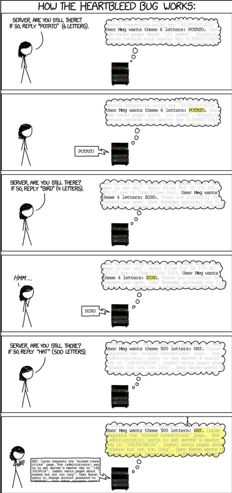

# Security
Security in microservices can feel like a minefield, and in some ways it is.

## Encryption and signing
When we look at ways of securing data, either at rest or in transport, many of the methods we discuss will be cryptographically
securing data.

### 1- Symmetric-key encryption
In this method, the sender and receiver must have a shared secret key that is kept confidential. This key is used to encrypt the plaintext message into a ciphertext message that can only be read by someone who has the same key and knows how to decrypt it. 
The symmetric-key encryption algorithm typically takes in the plaintext message and the secret key as input and outputs the ciphertext. The most common symmetric-key encryption algorithms include Advanced Encryption Standard (AES), Data Encryption Standard (DES), and Blowfish. 
While symmetric-key encryption is relatively fast and efficient, one of its main disadvantages is the need for secure key distribution. As both parties need to share the same key, any compromise of the key would result in the loss of confidentiality. 
For a remote end to be able to decrypt this information, it must first have the key, and this key must be securely held as a single compromise of one server will lead to the compromise of all servers who share this key. It can also make key management more complicated, as when you need to change the key, and you should change it often, you will need to roll this change out across your entire estate.

### 2- Asymmetric-key encryption (Public-key cryptography)
is a cryptographic method that uses two different but mathematically related keys - one public and one private. The public key is used to encrypt messages, and the private key is used to decrypt them. This makes it possible for people to securely communicate with each other without having to share their private encryption keys. 
In a public-key encryption system, anyone can use the public key to encrypt a message, but only the person who holds the corresponding private key can decrypt it. This ensures the confidentiality and authenticity of the communication, as only the intended recipient will be able to read and verify the message. 
Public-key cryptography is widely used in modern communication systems, including secure email, online banking, and e-commerce transactions. It is also used for digital signatures, which provide a way to verify the integrity and authenticity of electronic documents and messages. 
**Digital signatures**
A digital signature is created using the sender's private key to provide authentication, integrity, and non-repudiation for digital messages or documents. A digital signature ensures that the message or document has not been altered during transmission and that the sender is who they claim to be. 
To create a digital signature, the sender uses a mathematical algorithm to generate a unique code, called a hash, from the message or document. The sender then encrypts the hash using their private key, creating the digital signature. The recipient can then use the sender's public key to decrypt the signature and verify its authenticity by generating a new hash from the received message or document and comparing it to the decrypted signature. 
Public-key cryptography also gives us the capability of using digital signatures. A digital signature works by encrypting a
message with a private key and then transferring the signed message. If the message can be decrypted with the public key, then
the message must have originated from the holder of a private key. Due to the computation time of encrypting messages and the
increase in the size of the payload, a standard approach is to create a one-way hash of the message and then use the private key
to encrypt this. The recipient will decrypt the hash with the public key and generate the same hash from the message; then, the
message can be deemed to be from a trustworthy source.

### 3- X.509 digital certificates
X.509 digital certificates are a type of electronic document that is used to verify the identity of users, computers, and other entities on a network. They use public key cryptography to ensure that information exchanged over the network is secure and authenticated. 
An X.509 certificate contains information about the entity it represents, including its name, public key, and a digital signature from a trusted third-party known as a Certificate Authority (CA). The digital signature ensures that the certificate is valid and has not been tampered with.certificate. The purpose of the pricing is that the CA will ensure that you are who indeed you say you are; at present, the most popular CAs are Comodo, Symantec (previously Verisign before acquisition), and GoDaddy. 
X.509 certificates are commonly used for secure communication on the internet, such as HTTPS connections between web browsers and servers. They are also used for authentication and authorization in many other contexts, such as VPNs, email encryption, and code signing. 
One problem with public keys is that you must be careful that the key you think belongs to a recipient is owned by the recipient.
If keys are transferred across public networks, there is always the possibility of a man-in-the-middle attack. An attacker could
pose a fake public key as what you believe to be your trusted recipient; however, they could replace this with their keys. This
would mean that the message you think has been transferred securely could, in fact, be decrypted and read by a malicious third
party. 
To avoid these issues, digital certificates exist, simplifying the task of establishing whether a public key belongs to the reported
owner. 
A digital certificate contains three things:
* A public key
* Certificate information such as the owner's name or ID
* One or more digital signatures

### 4- TLS/SSL
SSL (Secure Sockets Layer) and TLS (Transport Layer Security) are both protocols used to provide encrypted communication between a client and server over the internet. The primary difference between them is that SSL is an older protocol, while TLS is its successor. 
SSL was originally developed by Netscape in the mid-1990s and was widely used for securing web traffic until it was superseded by TLS. TLS is a newer, more secure protocol that was designed to address some of the weaknesses in SSL. 
There have been several versions of both SSL and TLS released over the years, with each new version introducing improvements in security and performance. Today, TLS is considered the industry standard for secure communication on the web and is used extensively in applications like online banking, e-commerce, and email. 

## External security
This is your first line of defense to keep your systems safe, it is commonly comprised of layer 2 or 3 firewalls, DDoS
protection, web application firewalls, and other software and hardware. Before an attacker can compromise your application,
they must first pass through these layers of hardware and software which is not part of your application code but is a shared
infrastructure layer that many components in the application may share.

### 1-Layer 2 or 3 firewalls
* Layer 2 is more commonly used for routing as it deals purely with MAC addresses and not IP addresses and not IP addresses.
* layer 3 is IP address aware.
we limit the ports which are accessible to the outside
world and traffic destined for something which is not allowed is stopped at the firewall and does not get the chance to execute
an attack on the origin. In addition to this, it also allows us to restrict access to certain ports. For example, if you are running a
server, you most likely will want some form of remote access such as SSH. The Heartbleed exploit which came out in 2015
took advantage of a vulnerability in OpenSSH, and SSH servers which were directly exposed to the Internet would be prone to
this attack. Using a firewall effectively would mean that private ports such as SSH would be locked down to an IP address or IP
range, which could be your VPN, office IP, or public IP. This dramatically reduces the attack vector so while you might be
running a version of OpenSSH which is vulnerable to Heartbleed, for an attacker to take advantage of this, they would need to
be inside of your protected zone. 
The **Heartbleed vulnerability** exploited the ability to execute a buffer overrun attack. For example, you ask the server for a 4-
letter word but specify the length of 500; what you get back is the 4-letter word, and the remaining 496 characters are the blocks
of memory which follow the memory address of the initial allocation. In practice, this allowed a hacker to access chunks of
memory in the server randomly; this may contain items, such as change password requests, which give them credentials to
access the server. If you are running a globally available SSH server, then you may find you have a problem: 

### 2-Web application firewall (WAF)
A Web Application Firewall (**WAF**) is a security solution that protects web applications from various types of attacks, such as cross-site scripting (XSS), SQL injection, and other forms of malware. It sits between the web server and the Internet, analyzing incoming requests to the web application and blocking any malicious traffic before it can reach the application. 
The WAF uses a set of rules to examine the traffic and identify patterns or signatures of known attacks. These rules are often configurable by the administrator and can be adjusted based on the specific needs of the web application. The WAF can also learn from traffic patterns over time, allowing it to adapt to new threats and mitigate them more effectively. 
Overall, a WAF is an important tool for protecting web applications from cyberattacks and ensuring their availability and integrity. 
A web application firewall (WAF) is an application firewall for HTTP applications. It applies a set of rules to an HTTP conversation. These rules cover common attacks such as cross-site scripting (XSS) and SQL injection.While proxies protect clients, WAFs protect servers. A WAF is deployed to protect a specific web application or set of web applications. A WAF can be considered a reverse proxy.WAFs may come in the form of an appliance, server plugin, or filter, and may be customized to an application. The ef ort to perform this customization can be significant and needs to be maintained as the application is modified. 
**OWASP** stands for the Open Web Application Security Project. It is a non-profit organization that focuses on improving the security of software. OWASP provides resources, tools, and guidelines for secure application development and helps organizations understand and manage risks associated with web applications. The organization maintains a list of the top ten most critical web application security risks, called the OWASP Top Ten, which serves as a guide for developers and organizations to prioritize their security efforts. 
There is also another option: some CDN companies such as **Cloudflare** offer a hosted WAF. 

### 3-API Gateway
API Gateway is a service that allows you to create, manage, and deploy APIs (Application Programming Interfaces). It acts as a "front door" for applications to access data, business logic, or functionality from back-end services such as web applications, microservices, and serverless functions. 
API Gateway provides several key features such as authentication and authorization, traffic management, monitoring, and security. It also simplifies the development process for creating APIs by providing a centralized platform to manage API routes, request/response transformations, and versioning. 
API Gateway plays a critical role in modern application architectures, especially those using microservices and serverless computing, as it helps to decouple client-facing applications from back-end services, enabling greater flexibility, scalability, and agility. 
In addition to a WAF, an API Gateway can be a useful tool to have; this can serve a dual purpose of routing your public APIs to their backend services and some additional features such as token validation at the edge and input validation and transformation. When we talked about the confused deputy problem, where an attacker who is behind your firewall can execute
commands which they are not privileged to do, we looked at the possibilities for encrypting web tokens; the problem with this is that private keys for decrypting these tokens would need to be distributed across multiple backend services. This makes managing keys far more challenging than it should be. An API Gateway can simplify this situation by being the only layer
which can decrypt a message; the other services use the public key to verify a signature. API Gateways often implement many other first-line features such as but not limited to the following:
* Request validation
* Authorization
* Rate limiting
* Logging
* Caching
* Request and response transformations
**There is an element of crossover between a WAF and an API Gateway**; however, the two should be treated as two distinctly
separate parts of your infrastructure. Regarding providers of an API Gateway, this seems to be a developing area; AWS has an
advanced API Gateway which can be used if you have bought into the **AWS PaS** environment.  
For standalone deployments,
* Kong (https://getkong.org/)
* Tyk (https://tyk.io/) 
* Apigee (https://apigee.com/api-management/#/homepage)
Mashery (https://www.mashery.com/)
* and the Anypoint Platform from Mulesoft (https://www.mulesoft.com/) 
are among the leaders in this field. It is, of course, possible to build your own API Gateway backed with **Nginx or HAProxy**; however, I
recommend, you first check out one of the specific platforms before going ahead and building your own.

### 4-DDoS protection
DDoS stands for Distributed Denial of Service. It is a type of cyberattack in which multiple compromised systems, often infected with malware and controlled by an attacker, are used to flood a targeted system or network with traffic in order to overwhelm and disrupt its normal operation. The attack can be launched from anywhere in the world and can target any system that is connected to the internet, such as websites, servers, routers, and other network infrastructure. The purpose of a DDoS attack can vary, but it is often done to extort money, take down a competitor's website, or as a form of protest or hacktivism. DDoS attacks can be difficult to prevent and mitigate because the traffic appears to be legitimate, making it challenging to distinguish between attack traffic and legitimate traffic. 
DDoS protection refers to measures taken to defend against Distributed Denial of Service (DDoS) attacks, which are malicious attempts to disrupt normal traffic of a targeted server, service or network by overwhelming it with a flood of internet traffic from multiple sources. DDoS protection typically involves a combination of mitigation techniques such as rate limiting, access control, filtering and other methods to identify and block attack traffic while allowing legitimate traffic to pass through. These techniques can be implemented at different levels of the network stack, ranging from the application layer all the way down to the network infrastructure layer. The goal of DDoS protection is to ensure that the targeted system remains available and accessible to legitimate users despite the attack. 
On October 21, 2016, a massive internet outage was caused by attackers targeting DYN's DNS servers using a **Mirai botnet**.
The Mirai exploit takes advantage of vulnerabilities in IP cameras and DVRs made by the Chinese company called XionMai
Technologies. Rather than attacking a target, the attackers decided to take down a major part of the internet's infrastructure,
knocking out most of the east and west coast of America. The Mirai exploit takes advantage of just 60 usernames and
passwords to attempt to update the firmware of the vulnerable devices. Once the malware had been installed, the device was
then controllable by the botnet. All that was left to do was tell the bots to start a DNS attack against DYNs nameservers.The code for Mirai has been published online. 
**Types of DDoS attack**: The following are the types of DDos attack:
* UDP fragment
* DNS
* NTP
* Chargen
* UDP
* SYN
* SSDP
* ACK

## Application security
We now, hopefully, understand some of the ways that encryption works and some of the ways that our infrastructure is vulnerable, but what about our application? It is entirely plausible that someone will want to break into your system. While a DDoS attack might cause you some inconvenience for a day or so, a hacker who gets past your firewall and into your application servers could cause serious financial or reputational damage.
following four steps:
* Prevention
* Detection
* Response
* Recovery

### 1- Prevention
Prevention is where you should spend the most of your effort, and the remainder of this chapter will concentrate on just that.
This is implementing techniques for **secure communication**, **authorization**, and **authentication**.

### 2- Detection
Detection relates to your application logs and ModSecurity logs if you are using it. We discussed in the previous chapter some
methods for logging in your system, and I suggest you think about the type of logging you will need to detect malicious intent,
not just for fault finding. This should form part of your non-functional requirements when you are planning a feature.

### 3- Response
The response is how you tackle the breach: if an incident occurs, you need to deal with it immediately. This not only involves
closing the attackers out of the system but also identifying what has been taken and in the case of personal information or credit
card loss, contacting your customers and being open about the problem. Think about what your company does about fire drills
in case of fire. You practice so that, in the event there is a fire, everyone knows what to do and how to react quickly. Game days
are standard practice for a few companies, where they will rehearse disaster recovery situations. If you intend to practice your
response process, you need to ensure that the whole business is involved; while tech will be included in the diagnostic and
rectification of the problem, there needs to be involvement on a business level, legal, PR, and communications for this to be
truly useful.

### 4- Recovery
The recovery process should be the simplest step, assuming your infrastructure is well backed up and automated. Sam suggests
not taking any chances and burning it down, rebuilding with new keys and passwords to avoid a further attack.

### Attack Scenario
You are an e-commerce platform built utilizing the latest microservices architectural patterns. Your application code is running
in Docker containers and you are hosting everything on AWS with Kubenetes. The front end of the system is a simple Node.js
application which talks to a variety of private APIs to provide many of the transactional capabilities on the site. The application
itself does not have a database and there are no secrets stored in the container. 
An attacker finds a remote code execution vulnerability in the templating engine used for the front end presentation. They
discover that the system is running on Kubenettes and that the control API is available inside the compromised container. They
use this API to be able to launch a rogue container on your network which, running in privileged mode, starts a reverse SSH
tunnel to the attacker's remote server, which completely bypasses the firewall and gives them root access to the container. From
here, they sniff the traffic on the network and determine that the payment gateway has POST endpoint v1/refunds; by sending a
JSON payload to this endpoint, it is possible to refund huge amounts of money to an offshore bank account. 
Even though the firewall was protecting inbound traffic and only ports 80 and 443 were allowed inbound, the attacker leveraged
a vulnerability inside the application to be able to create a backdoor for themselves. The nonexistent security around launching
applications inside the production environment and open non-encrypted communication between the services gave them all they
needed to empty the company's bank account. 
This is a very real threat, but thankfully Go has many excellent tools to help us make it tough for an attacker.