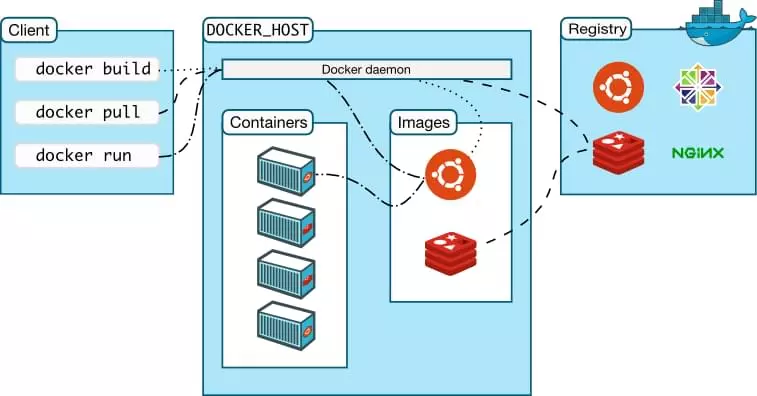
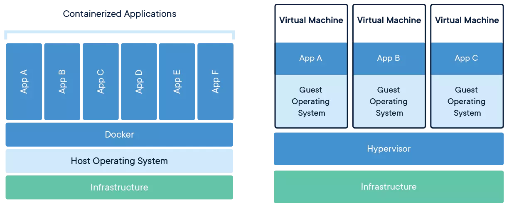

#Docker

## What is docker?
>Docker is the silver bullet that solved the problem with software containers and virtualization once and for all. Yes, that’s a strong claim! Other products had attempted to deal with these problems, but Docker’s fresh approach and ecosystem has wiped the competition off the map. This guide will help you understand the basic concepts of Docker.

- Docker is a technology that allows you to build, run, test, and deploy distributed applications. It uses operating-system-level virtualization to deliver software in packages called containers.
- The way Docker does this is by packaging an application and its dependencies in a virtual container that can run on any computer. This containerization allows for much better portability and efficiency when compared to virtual machines.
- These containers are isolated from each other and bundle their own tools, libraries, and configuration files. They can communicate with each other through well-defined channels. All containers are run by a single operating system kernel, and therefore use few resources.
- They’re portable and can run on any computer that has a Docker runtime environment.
- They’re isolated from each other and can run different versions of the same software without affecting each other.
- They’re extremely lightweight, so they can start up faster and use fewer resources.



## Docker Components and Tools
Docker consists of three major components:
- the **Docker Engine**, a runtime environment for containers
- the **Docker command line** client, used to interact with the Docker Engine
- the **Docker Hub**, a cloud service that provides registry and repository services for Docker images

n addition to these core components, there’s also a number of other tools that work with Docker, including:
- **Swarm**, a clustering and scheduling tool for dockerized applications
- **Docker Desktop**, successor of Docker Machine, and the fastest way to containerize applications
- **Docker Compose**, a tool for defining and running multi-container Docker applications
- **Docker Registry**, an on-premises registry service for storing and managing Docker images
- **Kubernetes**, a container orchestration tool that can be used with Docker
- **Rancher**, a container management platform for delivering Kubernetes-as-a-Service

## Installing Docker
[Take a look](https://docs.docker.com/engine/install/)


## Docker Containers



- Containers are often compared to virtual machines, but there are some important differences between the two. Virtual machines run a full copy of an operating system, whereas containers share the host kernel with other containers. This makes containers much more lightweight and efficient than virtual machines.
- A container image is a lightweight, stand-alone, executable package of a piece of software that includes everything needed to run it: code, runtime, system tools, system libraries, settings.
- Containers isolate software from its surroundings, for example, dif erences between development and staging environments and help reduce conflicts between teams running dif erent software on the same infrastructure.
- Docker containers are built from images, which are read-only template with all the dependencies and configurations required to run an application.
- 

A container, in fact, is a runtime instance of an image — what the image becomes in memory when actually executed. It runs completely isolated from the host environment by default, only accessing host files and ports if configured to do so. As such, containers have their own networking, storage, and process space; and this isolation makes it easy to move containers between hosts without having to worry about compatibility issues.<br/>  
Where they benefit application development is that we can take advantage of this when deploying these applications as it allows us to pack them closer together, saving on hardware resources. <br/>
From a development and test lifecycle, containers give us the capability to run production code on our development machines with no complicated setup; it also allows us to create that **Clean Room environment** without having different instances of the same database installed to trial new software. <br/>
Containers have become the primary choice for packaging microservices, Containers work by isolating processes and filesystems from each other. Unless explicitly specified, containers cannot access each other's file systems. They also cannot interact with one another via TCP or UDP sockets unless again specified.

- the **Dockerfile**, used to build the image.
- the **image** itself, a read-only template with instructions for creating a Docker container
- the **container**, a runnable instance created from an image (you can create, start, stop, move or delete a container using the Docker API or CLI)

## How to Run a Container?

## `docker run [ImageName]`
```dockerfile
 docker run --rm hello-world
```
When you execute a docker run the first thing the engine does is check to see if you have the image installed locally. If it doesn't then it connects to the default registry,in this case, https://hub.docker.com/ to retrieve it.
Once the image has been downloaded, the daemon can create a container from the downloaded image, all the output is streamed to the output on your terminal:

```
Unable to find image 'hello-world:latest' locally
latest: Pulling from library/hello-world
c04b14da8d14: Pull complete
Digest: sha256:0256e8a36e2070f7bf2d0b0763dbabdd67798512411de4cdcf9431a1feb60fd9
Status: Downloaded newer image for hello-world:latest

Hello from Docker!
This message shows that your installation appears to be working correctly.
```
### `--rm`
The `--rm` flag tells the Docker engine to remove the container and delete any resources such as volumes it was using on exit. Unless we would like to re-start a container at some point it is good practice to use the `--rm` flag to **keep our filesystem clean**, otherwise, all of the temporary volumes which are created will sit around and consume space.


```dockerfile
docker run -it --rm alpine:latest sh
```
Alpine is a lightweight version of Linux and is perfect for running Go applications. The `-it` flags stand for interactive terminal it maps the standard in from your terminal to the input of the running container. The sh statement after the name of the image we want to run is the name of the command we would like to execute in the container when it starts.

### `-it`
The `-i` flag stands for **interactive** and is used to keep stdin open even if not attached. The `-t` flag allocates a pseudo TTY device. Together, these two flags allow us to attach directly to our running container and give us an interactive shell session.
If we want to exit this shell, we can simply type `exit`.

>Containers are **immutable** instances of images, and the data volumes are by default **non-persistent**

after `touch mytestfile.txt` and restart container, you can see  file will not exist.

## `docker ps -a`
```dockerfile
docker ps -a
```
The `docker ps` command queries the engine and returns a list of the containers, by default this only shows the running containers, however, if we add the `-a` flag we can also see stopped containers.

## `docker start -it [container_id] sh`
```dockerfile
docker start -it [container_id] sh
```
This is the one we want to restart, so grab the ID of the container and execute the following command,So we can restart our container.

## `docker rm`
If you want to remove all the stopped containers you can use the following command:
```dockerfile
docker rm -v $(docker ps -a -q)
```
The `docker ps -a -q` the `-a` flag will list all the containers including the stopped ones, `-q` will return a list of the container IDs rather than the full details. We are passing this as a parameter list to docker rm, which will remove all the containers in the list.<br/>
To avoid having to remove a container we can use the `--rm` flag when starting a new container. This flag tells Docker to remove the container when it stops.

```dockerfile
docker rm -v [container_id/container_name]
```
Containers that start with a name parameter are not automatically removed even if you specify the `--rm` argument. <br/>
To remove a container started in this way, we must manually use the docker rm command. If we append the `-v` option to the command, we can also remove the volumes that are associated with it. 

## Docker volumes
We have seen how Docker containers are immutable; however, there are some instances when you may wish to write some files to a disk or when you want to read data from a disk such as in a development setup. Docker has the concept of volumes, which can be mounted either from the host running the Docker machine or from another Docker container.

### `-v hostfolder:destinationfolder`
```dockerfile
docker run -it -v $(pwd):/host alpine:latest /bin/sh
```
The `-v, or --volume` parameter allows you to specify a pair of values corresponding to the file system you wish to **mount** on the host and the path where you would like to mount the volume inside the container.<br/>
If you change into the host folder, you will see that there is access to the same folder from where you ran the docker run command. The syntax for the values for `-v is hostfolder:destinationfolder`. <br/>
one thing I think is **important** to point out is that these **_paths need to be absolute_**, ~~and you cannot use a relative path like ./ or ../foldername~~. <br/>
The volume you have just mounted has read/write access, any changes you make will be synchronized to the folder on the host so be careful to not go running rm -rf *. Creating Volumes on a production environment should be used very sparingly, I would advise that where possible you avoid doing it all together as in a production environment there is no guarantee if a container dies and is re-created that it will be replaced on the same host where it was previously. This means that any changes you have made to the volume will be lost.

## Docker ports
When running web applications inside a container, it is quite common that we will need to expose some ports to the outside world.By default, a Docker container is completely isolated, and if you start a server running on port 8080 inside your container unless you explicitly specify that port is accessible from the outside, it will not be accessible.Mapping ports is a good thing from a security perspective as we are operating on a principle of no trust.

```dockerfile
docker run -it --rm -v $(pwd):/src -p 8080:8080 -w /src golang:alpine /bin/sh
```
### `-w [Path]`
The `-w` flag we are passing is to set the working directory that means that any command we run in the container will be run inside this folder. When we start the shell, you will see that rather than having to change into the folder we specify in the second part of the volume mounting we are already in that folder and can run our application.

### golang:alpine
We are also using a slightly different image this time. We are not using alpine:latest, which is a lightweight version of Linux, we are using golang:alpine, which is a version of Alpine with the most recent Go tools installed.

## Docker networking
Docker networking is an interesting topic, and by default, Docker supports the following network modes:
* bridge
* host
* none
* overlay

### Bridge networking
